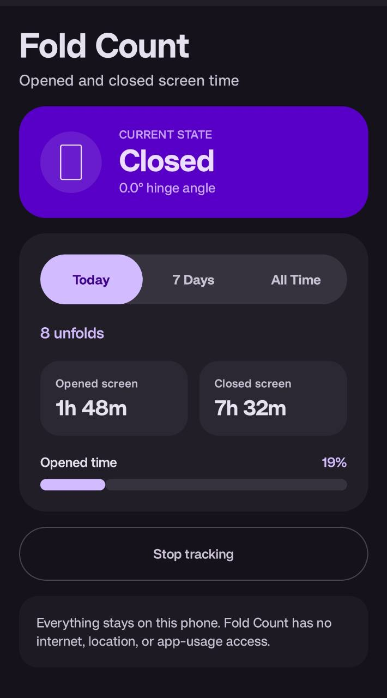
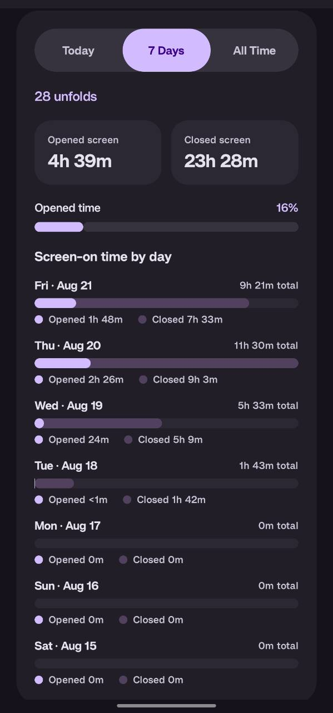
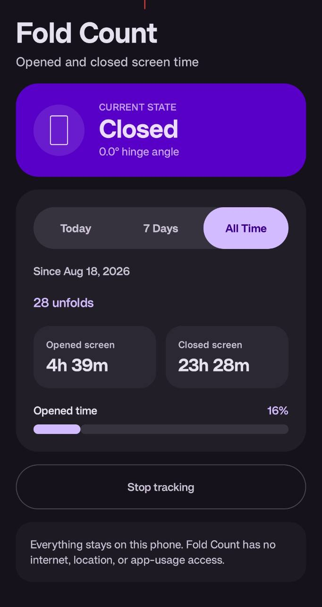

# Fold Count

Fold Count is a simple Android app that counts how often you unfold your phone and
compares screen-on time while it is opened versus closed. Everything is stored
locally on your phone.

It was made for and tested on the **OnePlus Open** running OxygenOS 16.0.3.
Hinge detection and fold counting are also confirmed on the **Samsung Galaxy Z
Flip7**. It uses Android's standard hinge-angle sensor, so other foldables are
welcome to try it and share how it goes.

## Install

### [Download the latest APK](https://github.com/teegles/Fold-Count/releases/download/v0.3.0-beta/Fold-Count-v0.3.0-beta.apk)

Download the APK on your phone, open it, and allow installation from your
browser or file manager if Android asks.

## Screenshots

<p>
  
  
  
</p>

## Build from source

Open this project in Android Studio, or run the tests and debug build:

```bash
./gradlew testDebugUnitTest lintDebug assembleDebug
```

The APK will be created at `app/build/outputs/apk/debug/app-debug.apk`.

## Privacy

Fold Count has no internet, location, or app-usage access. Android requires a
persistent notification so tracking can continue in the background. See the
[privacy policy](PRIVACY.md).

Release maintainers can use the [release guide](RELEASING.md).

## License

[MIT](LICENSE) — use, modify, and share it however you like.
